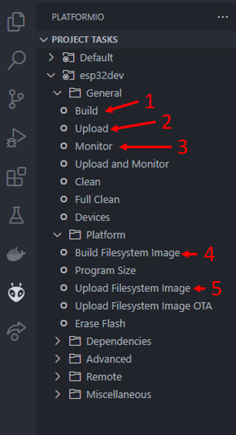

# Palletron CAN Driver
This repository contains the CAN driver used for the KTH MDA-HK Palletron project...

## Installation
Prepare the LILIGY T-CAN485 by connecting CAN-L, GND and CAN-H to a connector or directly to a CAN-bus. Since it features a usb-c port, this can be used for power, programming and debugging. 

### Install using platformio
[PlatformIO](http://platformio.org) is an open source ecosystem for IoT development with cross platform build system, library manager and full support for Espressif ESP8266/ESP32 development. It works on the popular host OS: Mac OS X, Windows, Linux 32/64, Linux ARM (like Raspberry Pi, BeagleBone, CubieBoard).

1. Install [Visual Studio Code](https://code.visualstudio.com/download).
2. Install [PlatformIO IDE plugin for VS-Code](https://platformio.org/install/ide?install=vscode).
4. Clone this repository to a location of your choosing, or download and extract the .zip file.
5. Open repository folder in VS-Code. Press `File`->`Open Folder` and open the repository folder.
6. Make sure to select "*Yes, I trust the authors*" if that dialouge pops up.
7. Platformio should now automatically initialize the project!

### Build and flash chip
Building the code and flashing it to the chip is made very easy thanks to the Platformio extension.
The device needs to be connected via USB for flashing to be possible.

  

#### Uploading and debugging
1. **Build** - Compiles the code without uploading, can be run without device connected.
2. **Upload** - Compiles and uploads the code (flashes the device).
3. **Monitor** - Start the Serial monitor and receive debug messages via Serial.

#### Uploading file system
The filesystem, formatted with LittleFS, is used to store webpage files and node configurations when SD is not present. This needs to be uploaded for the device to function.
Files meant for upload to the device are placed in the `Data` folder. Note that file system remains intact after program upload!

4. **Build Filesystem Image** - Compiles the files into filesystem image.
5. **Upload Filesystem Image** - Uploads (flashes) the filesystem image to the device. The image must be built before this is done!

## Uses libraries:
  - [ESP32CAN](https://github.com/miwagner/ESP32-Arduino-CAN), sligthly modified version.
  - [Magnetic Encoder](https://github.com/RobTillaart/AS5600/tree/master)

### EOL Core
This project is based on the platformio arduino framework for the esp32. The latest release version of this is the Arduino core 2.0.x while the active version of the ardino core is 3.0.x. Due to buissiness relations between platformio and espressif, the platformio Arduino core for the esp32 is no longer officially supported and will no longer be released. This project is still based on the 3.0.x core, but not from platformio.  More about this can be read in [this](https://github.com/platformio/platform-espressif32/issues/1225#issuecomment-2227415405) github issue. The core for the Arduino IDE is still being maintained and released. 
 

## Sources and information
 - [Heartbeat messages](https://product-help.schneider-electric.com/Machine%20Expert/V1.2/en/tm3bcprg/tm3bcprg/TM3_CANopen_Bus_Coupler/TM3_CANopen_Bus_Coupler-3.htm)
 - [SDO](https://webhelp.kollmorgen.com/akd2g/english/Content/AKD2G%20CANopen/CANopen_06_04_05%20Service%20Data%20Objects%20SDO.htm?tocpath=AKD2G%20CANopen%7CCommunication%20Profile%20%E2%80%93%20DS301%7CService%20Data%20Objects%20SDO%7C_____0)
 - [General CANopen](https://kvaser.com/about-can/higher-layer-protocols/canopen/)
 - [VESC CAN protocol](https://github.com/vedderb/bldc/blob/master/documentation/comm_can.md)
 - [Linak CAN information](https://cdn.linak.com/-/media/files/ic-and-bus-actuators/techline-canopen-user-manual-eng.pdf?_gl=1*grboug*_gcl_au*MTE2NzQ1MjE5OS4xNzI1ODg0MjE5)
